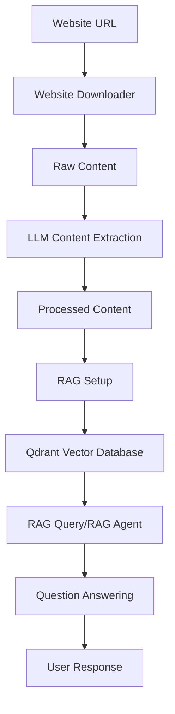

# crawl4AI-agent-v2

[](https://www.python.org/downloads/)
[](LICENSE)

A Python-based Retrieval-Augmented Generation (RAG) system that implements intelligent website crawling, content processing, and question-answering capabilities using state-of-the-art AI technologies.

## Table of Contents

- [Project Overview](#project-overview)
- [Key Features](#key-features)
- [Architecture Overview](#architecture-overview)
- [Prerequisites](#prerequisites)
- [Installation](#installation)
- [Configuration](#configuration)
- [Usage Examples](#usage-examples)
  - [1. Website Crawling and Content Extraction](#1-website-crawling-and-content-extraction)
  - [2. Process and Store Content in Qdrant](#2-process-and-store-content-in-qdrant)
  - [3. Query Content with RAG](#3-query-content-with-rag)
  - [4. Use the RAG Agent](#4-use-the-rag-agent)
  - [5. Simple Document Retrieval](#5-simple-document-retrieval)
- [Project Structure](#project-structure)
- [Contributing](#contributing)
- [License](#license)

## Project Overview

crawl4AI-agent-v2 is an advanced RAG (Retrieval-Augmented Generation) system that enables intelligent processing of website content for question-answering and information retrieval. The system leverages:

- **[crawl4ai](https://github.com/unclecode/crawl4ai)** for advanced website crawling with LLM-based content extraction
- **[Qdrant](https://qdrant.tech/)** as the vector database for semantic search and document storage
- **[DashScope/Qwen](https://dashscope.aliyun.com/)** for powerful language models and embeddings
- **[LangChain](https://www.langchain.com/)** and **[Pydantic AI](https://github.com/pydantic/pydantic-ai)** for orchestration and agent implementation

The project workflow involves crawling websites, intelligently extracting and processing content, storing it in a vector database with semantic embeddings, and then providing natural language question-answering capabilities over that content.

## Key Features

- **Intelligent Web Crawling**: Recursively crawl websites with browser automation and LLM-based content extraction
- **Content Processing**: Automatically extract key information, summarize content, and identify key points
- **Vector Storage**: Store processed content in Qdrant vector database with semantic embeddings
- **Semantic Search**: Perform similarity searches using DashScope's optimized embeddings
- **Question Answering**: Use Qwen LLM for natural language question answering over your content
- **Flexible Output**: Save content in both markdown and JSONL formats for various use cases
- **Concurrent Processing**: Support for parallel crawling with configurable depth and concurrency
- **Multiple Embedding Options**: Support for both DashScope and FastEmbed embeddings
- **Pydantic AI Agent**: Customizable AI agent with retrieval tools for complex interactions

## Architecture Overview



The system consists of five main components:
1. **Website Downloader**: Crawls websites and extracts content using LLMs
2. **RAG Setup**: Processes content and stores it in Qdrant with embeddings
3. **RAG Query**: Provides semantic search and question-answering capabilities
4. **RAG Agent**: Implements a Pydantic AI agent with custom retrieval tools
5. **Document Retrieval**: Simple interface for querying documents from Qdrant

## Prerequisites

- Python 3.13 or higher
- DashScope API key (for Qwen LLM and embeddings)
- Qdrant instance (local or cloud)
- Git (for cloning the repository)

## Installation

1. Clone the repository:
```bash
git clone https://github.com/your-username/crawl4AI-agent-v2.git
cd crawl4AI-agent-v2
```

2. Install dependencies using `uv` (recommended) or `pip`:

Using `uv`:
```bash
# Install uv if you haven't already
pip install uv

# Install project dependencies
uv sync
```

Using `pip`:
```bash
pip install -r requirements.txt
```

3. Install Playwright dependencies (required for crawl4ai):
```bash
playwright install-deps
playwright install chromium
```

## Configuration

1. Copy the template environment file:
```bash
cp .env.template .env
```

2. Edit the `.env` file and add your API keys:
```env
# DashScope API configuration for Qwen LLM and embeddings
DASHSCOPE_API_KEY=your_dashscope_api_key_here

# Qdrant configuration
QDRANT_URL=your_qdrant_url_here
QDRANT_API_KEY=your_qdrant_api_key_here
```

For a local Qdrant instance, you can use:
```env
QDRANT_URL=http://localhost:6333
QDRANT_API_KEY=  # Leave empty for local instances
```

## Usage Examples

### 1. Website Crawling and Content Extraction

Download and process website content with LLM-based extraction:

```bash
python website_downloader.py https://example.com -o downloaded_content --max-depth 2
```

Options:
- `-o, --output-dir`: Output directory (default: downloaded_website)
- `-d, --max-depth`: Maximum crawl depth (default: 3)
- `-c, --max-concurrent`: Concurrent requests (default: 5)
- `--no-llm`: Disable LLM extraction (use standard markdown)
- `--consolidate-output`: Combine all JSONL data into a single file

Example with more options:
```bash
python website_downloader.py https://docs.example.com -o docs_content -d 3 -c 10 --consolidate-output
```

### 2. Process and Store Content in Qdrant

Process downloaded content and store it in Qdrant vector database:

```bash
python rag_setup.py downloaded_content --collection my_docs
```

Options:
- `--collection`: Qdrant collection name (default: website_docs)
- `--format`: File format to process (auto, markdown, jsonl)

Example:
```bash
python rag_setup.py docs_content --collection documentation_v1 --format jsonl
```

### 3. Query Content with RAG

Ask questions about your content using semantic search and Qwen LLM:

```bash
# Question answering mode
python rag_query.py "What is this website about?" --collection my_docs
```

Semantic search only (without LLM):
```bash
python rag_query.py "key features" --collection my_docs --search-only
```

Additional options:
- `--collection`: Qdrant collection name
- `--qdrant-url`: Qdrant URL (default: http://localhost:6333)
- `--top-k`: Number of results to return (default: 5)

### 4. Use the RAG Agent

Use the Pydantic AI agent with custom retrieval tools:

```bash
python rag_agent_qdrant.py --question "What are the main features?" --collection my_docs
```

Options:
- `--question`: The question to answer
- `--collection`: Qdrant collection name (default: docs)
- `--embedding-method`: Embedding method (openai or fastembed)
- `--n-results`: Number of results to retrieve (default: 5)

Example with FastEmbed:
```bash
python rag_agent_qdrant.py --question "How do I configure this?" --collection my_docs --embedding-method fastembed
```

### 5. Simple Document Retrieval

Perform semantic search on documents in Qdrant:

```bash
python retrieve_docs_qdrant.py "search query" --collection my_docs
```

Options:
- `--collection`: Qdrant collection name (default: docs)
- `--embedding-method`: Embedding method (openai or fastembed)
- `--n-results`: Number of results to return (default: 5)
- `--score-threshold`: Minimum similarity score (0-1)
- `--full-content`: Show full document content instead of preview

Example:
```bash
python retrieve_docs_qdrant.py "API configuration" --collection my_docs --n-results 10 --score-threshold 0.7
```

## Project Structure

```
crawl4AI-agent-v2/
├── website_downloader.py     # Website crawling and content extraction
├── rag_setup.py             # Process and store content in Qdrant
├── rag_query.py             # Query content with RAG
├── rag_agent_qdrant.py      # Pydantic AI agent with RAG
├── retrieve_docs_qdrant.py  # Simple document retrieval
├── custom_dashscope_embeddings.py  # Custom DashScope embeddings
├── main.py                  # Main entry point/demo
├── .env.template           # Template for environment variables
├── pyproject.toml          # Project dependencies and metadata
├── requirements.txt        # Alternative dependencies file
├── README.md              # This file
└── downloaded_website/     # Default output directory for crawled content
```

## Contributing

Contributions are welcome! Here's how you can contribute:

1. Fork the repository
2. Create a feature branch: `git checkout -b feature-name`
3. Commit your changes: `git commit -am 'Add new feature'`
4. Push to the branch: `git push origin feature-name`
5. Create a pull request

Please ensure your code follows Python best practices and includes appropriate documentation.

## License

This project is licensed under the MIT License - see the [LICENSE](LICENSE) file for details.

---

Built with ❤️ using [crawl4ai](https://github.com/unclecode/crawl4ai), [Qdrant](https://qdrant.tech/), [DashScope](https://dashscope.aliyun.com/), [LangChain](https://www.langchain.com/), and [Pydantic AI](https://github.com/pydantic/pydantic-ai).